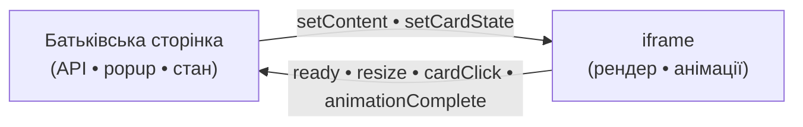
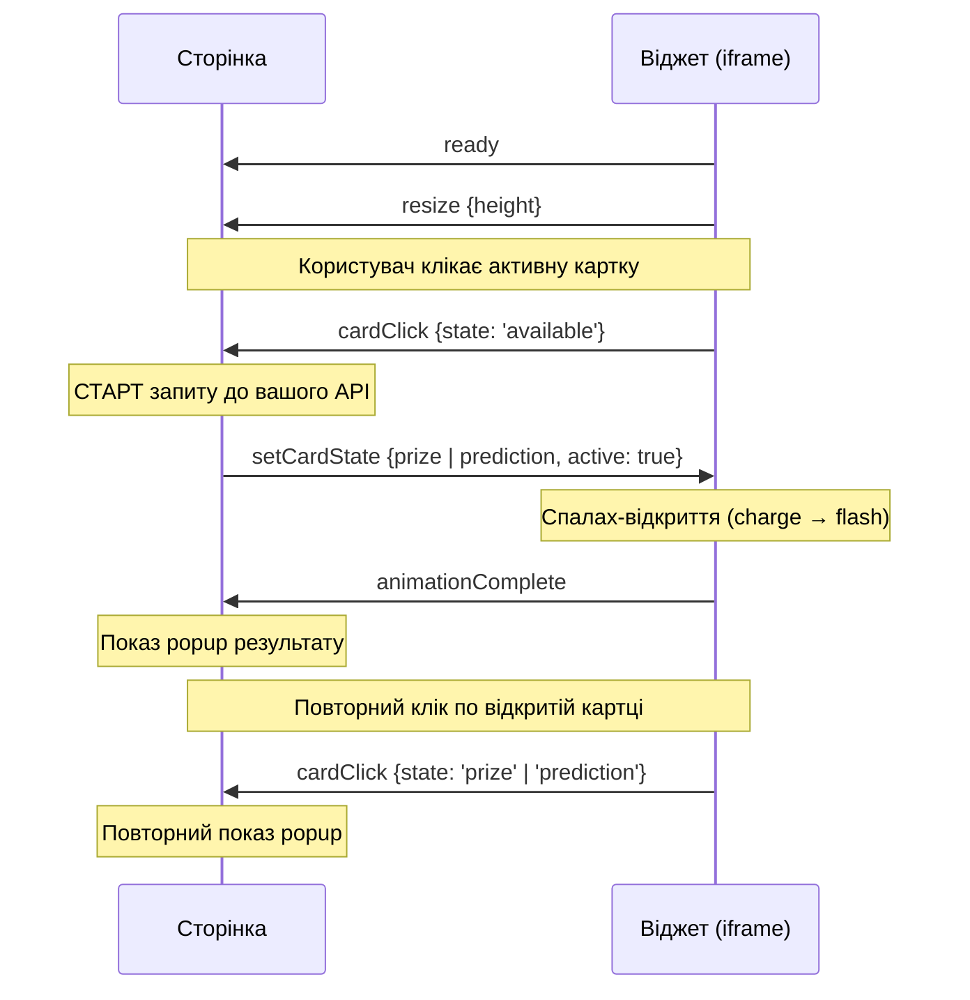

# Vegas Lootboxes — посібник з інтеграції

Цей документ — **єдине джерело істини** щодо вбудовування віджета Vegas Lootboxes
у батьківську сторінку: швидкий старт, передача даних, протокол `postMessage`,
сценарій відкриття картки та поведінка анімацій. Для інтерактивної перевірки без
написання коду скористайтеся пісочницею `lootbox-test/index.html`.

> **Модель віджета.** iframe — це **рендерер**. Він малює карусель карток і програє
> анімації, але **не** робить API-запитів, не визначає приз і не зберігає стан між
> сесіями. Дані карток, popup результату, blur фону та будь-який інший UI поза
> каруселлю — зона відповідальності батьківської сторінки.

## Зміст

1. [Швидкий старт](#1-швидкий-старт)
2. [Модель взаємодії](#2-модель-взаємодії)
3. [Передача даних карток: два способи](#3-передача-даних-карток-два-способи)
4. [Сценарій відкриття картки](#4-сценарій-відкриття-картки)
5. [Протокол postMessage](#5-протокол-postmessage)
6. [Query-параметри](#6-query-параметри)
7. [Стани карток](#7-стани-карток)
8. [Анімації](#8-анімації)
9. [Команди пісочниці](#9-команди-пісочниці)
10. [Розгортання](#10-розгортання)

## 1. Швидкий старт

Вбудуйте віджет через `<iframe>`. Висоту **не фіксуйте** — віджет сам повідомляє
актуальну висоту подією `resize`.

> **ℹ️ Актуальна адреса.** Поточний CDN-хост — `https://cdn-wl.s3.amazonaws.com`,
> префікс шляху — `common/widgets-smartico/`. У прикладах нижче використані саме
> вони. **Ця адреса може змінитися** (інший бакет/оточення, перейменування папок).
> Тому в коді винесіть хост і базовий шлях в **одну константу** (`WIDGET_SRC` /
> `WIDGET_ORIGIN`) і не «розмазуйте» URL по проєкту — тоді зміна адреси = правка
> в одному місці.

```html
<iframe
  id="lootbox-widget"
  src="https://cdn-wl.s3.amazonaws.com/common/widgets-smartico/lootbox/index.html?lang=en&origin=https%3A%2F%2Fyour-site.com"
  style="width: 100%; border: 0;"
  title="Vegas Lootboxes"
  loading="lazy"
></iframe>
```

Мінімальний обробник на боці сторінки — підписка на висоту:

```js
const iframe = document.getElementById('lootbox-widget');
// Origin, з якого віддається віджет (CDN-хост із src iframe).
const WIDGET_ORIGIN = 'https://cdn-wl.s3.amazonaws.com';

window.addEventListener('message', ({ source, origin, data }) => {
  if (source !== iframe.contentWindow) return;   // лише наш iframe
  if (origin !== WIDGET_ORIGIN) return;          // лише очікуваний origin
  if (!data) return;
  const { type, data: payload } = data;

  if (type === 'resize') {
    iframe.style.height = `${Math.ceil(payload.height)}px`;
  }
  // Решта подій — у §4 (сценарій) та §5 (повний протокол).
});
```

Далі оберіть спосіб передачі даних карток (§3) і, якщо картки можна відкривати,
реалізуйте сценарій відкриття (§4).

> **⚠️ Безпека / Origin (обов'язково для проду).** У URL віджета **завжди**
> передавайте `origin=` зі схемою та хостом батьківської сторінки
> (напр. `origin=https%3A%2F%2Fyour-site.com`). Тоді віджет приймає команди
> **лише** з цього origin і надсилає події **лише** на нього. Без валідного
> `origin` віджет працює у **дозвільному** режимі (`*`) — прийнятно лише для
> локальної пісочниці. З боку сторінки теж перевіряйте `event.origin`
> (origin, з якого віддається iframe) і `event.source === iframe.contentWindow`.

## 2. Модель взаємодії

Сторінка й віджет обмінюються повідомленнями через `window.postMessage`. Формат
кожного повідомлення однаковий: `{ type: string, data?: object }`.

- **Сторінка → віджет** (команди): передати повний набір карток (`setContent`),
  оновити одну картку (`setCardState`), керувати скелетоном (`setLoading`).
- **Віджет → сторінка** (події): `ready`, `resize`, `cardClick`, `animationComplete`.



Дочекайтеся події `ready` перед надсиланням будь-яких команд у віджет — до неї
iframe ще ініціалізується.

## 3. Передача даних карток: два способи

Набір карток можна передати або в URL, або повідомленням `setContent`. Обидва
способи рівноцінні — оберіть за ситуацією; їх також можна поєднувати.

### Спосіб A — query-параметри в `src`

Картки кодуються прямо в URL iframe, згруповані за індексом (`c1_*`, `c2_*`, …).
Підходить, коли набір відомий на момент рендеру сторінки й невеликий.

```html
<iframe
  src="https://cdn-wl.s3.amazonaws.com/common/widgets-smartico/lootbox/index.html?lang=en
       &c1_state=prize&c1_date=1%20Mar&c1_title=20%20CAD%20bonus&c1_prize=bonus-money
       &c2_state=available&c2_date=2%20Mar
       &c3_state=locked&c3_date=3%20Mar"
></iframe>
```

Повний перелік параметрів — §6.

### Спосіб B — `setContent` через postMessage

iframe відкривається з коротким URL (лише `lang` / `origin`, за потреби `count`).
Поки даних немає — віджет показує скелетон. Щойно набір готовий, сторінка надсилає
`setContent { cards[] }`, і віджет малює карусель. Підходить для великих наборів
(немає ліміту довжини URL), даних, що приходять асинхронно, а також для оновлення
карток без перезавантаження iframe.

```js
iframe.src =
  'https://cdn-wl.s3.amazonaws.com/common/widgets-smartico/lootbox/index.html?lang=en&origin=' +
  encodeURIComponent(location.origin);

window.addEventListener('message', ({ source, origin, data }) => {
  if (source !== iframe.contentWindow) return;
  if (origin !== 'https://cdn-wl.s3.amazonaws.com') return;   // лише очікуваний origin

  if (data?.type === 'ready') {
    iframe.contentWindow.postMessage(
      {
        type: 'setContent',
        data: {
          cards: [
            { index: 1, state: 'prize', date: '1 Mar', title: '20 CAD bonus', prizeType: 'bonus-money', tag: 'Opened' },
            { index: 2, state: 'available', date: '2 Mar' },
            { index: 3, state: 'locked', date: '3 Mar' },
          ],
        },
      },
      'https://cdn-wl.s3.amazonaws.com',
    );
  }
});
```

### Що обрати

- Статичний, наперед відомий набір → **спосіб A**.
- Динамічні дані, багато днів або асинхронний бекенд → **спосіб B** (короткий URL
  + `setContent` після `ready`). Це рекомендований шлях для більшості інтеграцій.

## 4. Сценарій відкриття картки

Найважливіша частина інтеграції. Віджет сам програє анімації, а сторонні дії
(запит до API та popup результату) виконує сторінка — у чітко визначені моменти.



Покроково:

1. **Вбудуйте iframe** і передайте картки (§3).
2. **Дочекайтеся `ready`** — далі безпечно надсилати команди у віджет.
3. **На `resize`** — виставте `iframe.style.height` значенням з `data.height`.
4. **На `cardClick` зі `state: 'available'`** — **одразу зробіть запит до свого API**.
   Поки бекенд відповідає, віджет програє «зарядку» кулі (loop), що маскує затримку.
5. **Коли API відповів** — надішліть `setCardState` з результатом (`prize` або
   `prediction`, `active: true`). Віджет накриє картку спалахом і під ним підмінить
   арт на фінальний результат.
6. **На `animationComplete`** (приходить після згасання спалаху) — покажіть
   **перший** popup результату.
7. **На повторний `cardClick`** зі `state: 'prize'` / `'prediction'` (сьогоднішня
   відкрита картка з `active: true` і заданим `cta`) — покажіть popup **знову**,
   без повторної анімації.
8. **Після дії в popup** (напр. «Go to Bonuses») — виконайте навігацію на своєму
   боці; за потреби надішліть `setCardState { cta: '' }`, щоб прибрати CTA з картки.

> ### Коли показувати popup
>
> Подія `cardClick` приходить у **двох** випадках і розрізняється полем `data.state`.
> Не прив'язуйте popup до `cardClick` без перевірки `state`:
>
> - `state: 'available'` — **перший** клік, старт відкриття. Результату ще немає →
>   лише запускайте запит до API, **popup не показуйте**.
> - `state: 'prize'` / `'prediction'` — **повторний** клік по вже відкритій
>   сьогоднішній картці → тут можна показати popup знову.
>
> **Перший** popup показуйте **лише на `animationComplete`** — це момент, коли
> результат уже відкрито спалахом.
>
> ```js
> window.addEventListener('message', ({ source, origin, data: msg }) => {
>   if (source !== iframe.contentWindow || origin !== WIDGET_ORIGIN || !msg) return;
>   const { type, data } = msg;
>
>   if (type === 'cardClick') {
>     if (data.state === 'available') startApiRequest(data); // старт API, без popup
>     else openResultPopup(data);                            // prize/prediction → повторний popup
>   }
>
>   if (type === 'animationComplete') openResultPopup(data);  // перший popup — лише тут
> });
> ```
>
> `startApiRequest` і `openResultPopup` — це **ваші** функції-приклади (назвіть як
> завгодно). Віджет їх не надає й не диктує реалізацію: запит до API, popup, blur
> фону та будь-який UI поза каруселлю — на боці FE. Віджет лише надсилає події
> `cardClick` / `animationComplete`, а ви реагуєте на них як зручно.

## 5. Протокол postMessage

Формат усіх повідомлень: `{ type: string, data?: object }`.

### Віджет → сторінка (події)

| `type`              | `data`                 | Коли надсилається |
|---------------------|------------------------|-------------------|
| `ready`             | `{ count }`            | Перший рендер завершено — безпечно надсилати команди. |
| `resize`            | `{ height }`           | Змінилася висота рендеру — оновіть висоту iframe. |
| `cardClick`         | `{ index, id, state }` | Клік по картці. `state: 'available'` → старт запиту до API (**без** popup); `state: 'prize'` / `'prediction'` → повторний показ popup. Див. врізку в §4. |
| `animationComplete` | `{ index, id, state }` | Спалах-відкриття завершено (після `setCardState`) — момент показати **перший** popup. |

### Сторінка → віджет (команди)

| `type`         | `data`                                                                | Дія |
|----------------|-----------------------------------------------------------------------|-----|
| `setContent`   | `{ cards: [] }`                                                       | Замінює **весь** набір карток. Основний спосіб передати повний початковий набір без довгого URL (§3, спосіб B). |
| `setCardState` | `{ index\|id, state, title?, cta?, tag?, date?, prizeType?, active? }` | Оновлює **одну** наявну картку (не створює нових). Використовується для показу результату відкриття. |

Поля об'єктів у `cards[]` збігаються з query-параметрами без префікса `c{i}_`
(напр. `c{i}_state` → `state`); замість `c{i}_prize` — `prizeType`.

## 6. Query-параметри

Параметри кожної картки згруповані за індексом: `c1_*`, `c2_*`, `c3_*` тощо.
Додати або прибрати день — додати чи прибрати одну групу `c{i}_*`.

### Глобальні

| Параметр | Тип     | За замовч. | Опис |
|----------|---------|------------|------|
| `lang`   | string  | `en`       | Код мови для локалізації та аналітики. |
| `count`  | number  | —          | Гарантує рендер індексів `1..count` (пропущені = `locked`). |
| `origin` | string  | — (обов'язковий для проду) | Origin батьківської сторінки зі схемою (напр. `https://your-site.com`) для обмеження `postMessage`. Невалідний/відсутній → дозвільний режим (`*`), лише для пісочниці. Див. врізку в §1. |
| `debug`  | boolean | `false`    | Відкриває `window.__lootboxWidget` у devtools. |

### Картка — `c{i}_*`

| Параметр      | Тип    | Опис |
|---------------|--------|------|
| `c{i}_state`  | enum   | `available`, `locked`, `prize`, `prediction`, `missed`. Невідомі → `locked`. |
| `c{i}_id`     | string | Стабільний ідентифікатор. За замовч. — рядок з індексу. |
| `c{i}_date`   | string | Дата для відображення (`1 Mar`). |
| `c{i}_title`  | string | Заголовок картки. |
| `c{i}_cta`    | string | Підпис CTA (`"Go to Bonuses"`) для відкритих карток. |
| `c{i}_prize`  | enum   | Арт призу: `bonus-money`, `cash`, `coin`, `free-spins`. У postMessage — поле `prizeType`. |
| `c{i}_active` | bool   | `true` = сьогоднішній результат (свічення, без бейджа «Opened»). Лише для `prize` / `prediction`. |
| `c{i}_tag`    | string | Перевизначення бейджа статусу. |

Приклад URL із різними станами:

```text
?c1_state=prize&c1_date=1%20Mar&c1_title=20%20CAD%20bonus&c1_prize=bonus-money
&c2_state=missed&c2_date=2%20Mar
&c3_state=available&c3_date=3%20Mar
&c4_state=locked&c4_date=4%20Mar
```

Без параметрів карток — валідний стан: віджет покаже скелетон до отримання
`setContent`.

## 7. Стани карток

| Slug         | Значення                                   | Інтерактивність |
|--------------|--------------------------------------------|-----------------|
| `available`  | Сьогоднішній день, доступний до відкриття  | Клікабельна — генерує `cardClick`. |
| `locked`     | Майбутній / недоступний день               | Не клікабельна. |
| `prize`      | Відкрито, випав приз                        | Клікабельна лише коли `active: true` і задано `cta` (повторний popup). |
| `prediction` | Відкрито, без призу (передбачення)         | Клікабельна лише коли `active: true` і задано `cta` (повторний popup). |
| `missed`     | Пропущений день                            | Не клікабельна. |

## 8. Анімації

Усі анімації живуть **усередині** iframe і не потребують дій від сторінки — окрім
реакції на `animationComplete`. Відкриття складається з двох фаз, розведених по
подіях протоколу, щоб показ результату визначався відповіддю бекенду.

**Фаза 1 — «Зарядка» (на `cardClick`).** Диско-шар пульсує зациклено, маскуючи
затримку бекенду. Результат ще невідомий; фаза триває стільки, скільки відповідає
API — хоч кілька секунд.

**Фаза 2 — «Спалах-відкриття» (на `setCardState`).** Спалах накриває картку; на
піку спалаху контент підміняється під білим на фінальний результат — тож приз або
передбачення з'являються «зсередини» спалаху. Коли спалах згасає, віджет надсилає
`animationComplete`.

| Елемент             | Стан                                                              | Поведінка |
|---------------------|-------------------------------------------------------------------|-----------|
| Диско-шар           | `available`                                                       | Зациклене обертання. Прогресивне завантаження: skeleton → постер → анімація. |
| Світіння (промені)  | `available`, сьогоднішній `prize`/`prediction` (`active`), наступна `locked` | Обертання лише на цих картках; решта отримують статичне свічення без обертання. |
| Рука-підказка       | `available`                                                       | Idle-натяк «натисни», ховається після кліку. |
| Зарядка кулі        | Фаза 1 (очікування API)                                           | Куля пульсує, поки чекаємо відповідь бекенду. |
| Спалах (flash)      | Фаза 2                                                            | Повнокартковий спалах; на піку — підміна контенту на результат. |

**Таймінги відкриття.** Значення в `OPEN_ANIMATION` (`lootbox/modules/constants.js`)
підігнані під поточні SVGator-експорти `flash.svg` / `confetti.svg`. При заміні
ассетів — звірити тривалість експорту і оновити насамперед `FLASH_SVG_MS`,
`SWAP_AT_MS`, `CONFETTI_AT_MS`, `COMPLETE_AT_MS`.

**Затримка бекенду.** Спалах одноразовий і починається **тільки** коли прийшов
`setCardState` — тож він ніколи не «висить». Поки чекаємо, крутиться зарядка кулі.

**Skeleton** ховається лише після завантаження основних ресурсів карток (фони,
об'єкти, світіння); важкий анімований шар довантажується ліниво після появи карток.

**Accessibility.** При `prefers-reduced-motion: reduce` показуються статичні кадри
(постер шара, без руки та важких переходів).

## 9. Команди пісочниці

Ці команди призначені **лише для ручного тестування** в пісочниці й **не
використовуються** в продакшен-інтеграції.

| `type`       | `data`                  | Призначення |
|--------------|-------------------------|-------------|
| `playOpen`   | `{ index\|id, state? }` | Форсує весь сиквенс відкриття без реального кліку (зарядка → спалах). `state` (`prize` / `prediction`) задає результат. |
| `setLoading` | `{ loading }`           | Примусово вмикає/вимикає скелетон. |

## 10. Розгортання

Ручне завантаження на CDN. Кроки збірки та вивантаження — у `README.md`
(`common/widgets-smartico/lootbox`).

### Поточні бойові адреси

| Що | URL |
|----|-----|
| Віджет (iframe `src`) | `https://cdn-wl.s3.amazonaws.com/common/widgets-smartico/lootbox/index.html` |
| Пісочниця інтеграції  | `https://cdn-wl.s3.amazonaws.com/common/widgets-smartico/lootbox-test/index.html` |
| Origin для перевірки `event.origin` | `https://cdn-wl.s3.amazonaws.com` |

> **⚠️ Адреса може змінитися.** Це поточне розгортання. Хост чи префікс шляху
> (`common/widgets-smartico/…`) можуть змінитися при переїзді на інший
> бакет/оточення або перейменуванні папок. Тримайте хост + базовий шлях в одній
> константі на своєму боці, щоб оновлення адреси було правкою в одному місці.
> Пісочниця (`lootbox-test/`) і віджет (`lootbox/`) **завжди** лежать поруч під
> одним префіксом — інакше пісочниця не знайде віджет (`../lootbox/index.html`).
