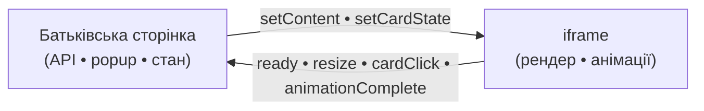
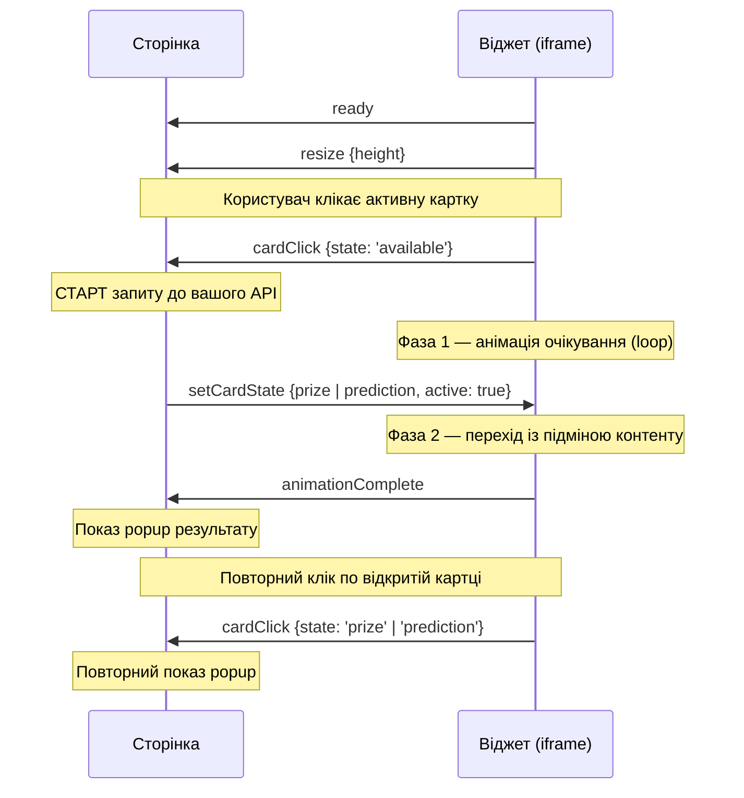

# Lootboxes — посібник з інтеграції

Цей документ — **єдине джерело істини** щодо вбудовування віджета Lootboxes
у батьківську сторінку: швидкий старт, передача даних, протокол `postMessage`,
сценарій відкриття картки та поведінка анімацій. Для інтерактивної перевірки без
написання коду скористайтеся пісочницею `lootbox-test/index.html`.

> **Один контракт, кілька брендів.** Віджет випускається окремою папкою на бренд
> (`lootbox/` — Vegas, `lootbox-2/` — Thor). Протокол, стани карток і
> query-параметри в них **однакові** — інтеграція пишеться один раз. Відрізняються
> лише графіка, анімації та словник призів; усе брендозалежне зібрано в
> [§11 Додатки по брендах](#11-додатки-по-брендах). Обираючи бренд, ви змінюєте
> **лише** шлях у `src` iframe.

> **Модель віджета.** iframe — це **рендерер**. Він малює карусель карток і програє
> анімації, але **не** робить API-запитів, не визначає приз і не зберігає стан між
> сесіями. Дані карток, popup результату, blur фону та будь-який інший UI поза
> каруселлю — зона відповідальності батьківської сторінки.

**Що змінилось у цій версії** — якщо ви читали попередню, Vegas-only редакцію

Протокол **не змінився**: усе, що вже написано під Vegas, працює далі без правок.
Додалось:

- документ став мультибрендовим: з'явився §11 з відмінностями брендів, а адреса
віджета тепер обирає бренд (`lootbox/` — Vegas, `lootbox-2/` — Thor);
- нові **опціональні** поля картки `subtitle`, `timerTo`, `timer` і нова подія
`timerEnd` — їх рендерять/надсилають не всі бренди, матриця в §11;
- пісочниця перемикається між брендами: `lootbox-test/index.html?project=thor`;
- словник `prizeType` тепер один на всі бренди (§11). Thor раніше називав монету
`coins` — значення досі приймається, але канонічне ім'я `coin`;
- **два нові типи призу — `free-chips` і `bonus-money`** (§11), обидва бренди їх
малюють. Разом з цим `bonus-money` **перестав бути псевдонімом** `cash` і став
самостійним призом — єдина зміна поведінки в цій версії, деталі у врізці в §11;
- §8 «Анімації» описує спільну модель двох фаз, а конкретика кожного бренда
(диско-шар Vegas, портал Thor) переїхала у §11.


## 🚀 TL;DR — що робить FE (мінімум для інтеграції)

Якщо коротко, для інтеграції достатньо семи кроків. Решта документа — деталі й
довідка.

1. **Вставити** `<iframe>` з `origin=<ваш-origin>` у `src` (§1).
2. **Слухати** `message`, перевіряти `event.source` та `event.origin` (§1).
3. **На** `resize` — оновлювати висоту iframe (§1).
4. **Передати картки** — надіслати `setContent` після `ready` (§3, спосіб B).
5. **Обробити відкриття**: `cardClick(available)` → ваш API → `setCardState` →
  на `animationComplete` показати popup (§4).
6. **Звірити §11 для свого бренду** — які опціональні поля він рендерить
  (`subtitle`, `timerTo` / `timer`) і чи надсилає подію `timerEnd`. Кроки 1–5 від
   бренду не залежать, ці три поля — залежать.
7. **Перевірити** все в пісочниці перед релізом (§9 + URL у §10).

Все, що потрібно писати кодом, — у секціях, позначених **[обов'язково]**. Секції
**[довідково]** читати не обов'язково: код там не пишеться.

## Зміст

1. [Швидкий старт](#1-швидкий-старт--обовязково) — **[обов'язково]**
2. [Модель взаємодії](#2-модель-взаємодії--обовязково) — **[обов'язково]**
3. [Передача даних карток: два способи](#3-передача-даних-карток-два-способи--обовязково) — **[обов'язково]**
4. [Сценарій відкриття картки](#4-сценарій-відкриття-картки--обовязково) — **[обов'язково]**
5. [Протокол postMessage](#5-протокол-postmessage--обовязково) — **[обов'язково]**
6. [Query-параметри](#6-query-параметри--довідково) — **[довідково]**
7. [Стани карток](#7-стани-карток--довідково) — **[довідково]**
8. [Анімації](#8-анімації--довідково) — **[довідково]**
9. [Команди пісочниці](#9-команди-пісочниці--довідково) — **[довідково]**
10. [Розгортання](#10-розгортання--для-деплою) — **[для деплою]**
11. [Додатки по брендах](#11-додатки-по-брендах) — **[обов'язково для свого бренду]**


## 1. Швидкий старт — [обов'язково]

Вбудуйте віджет через `<iframe>`. Висоту **не фіксуйте** — віджет сам повідомляє
актуальну висоту подією `resize`.

> **ℹ️ Актуальна адреса.** Поточний CDN-хост — `https://cdn-wl.s3.amazonaws.com`,
> префікс шляху — `common/widgets-smartico/`. У прикладах нижче використані саме
> вони. **Ця адреса може змінитися** (інший бакет/оточення, перейменування папок).
> Тому в коді винесіть хост і базовий шлях в **одну константу** (`WIDGET_SRC` /
> `WIDGET_ORIGIN`) і не «розмазуйте» URL по проєкту — тоді зміна адреси = правка
> в одному місці.

Папка в шляху обирає бренд: `lootbox/` — Vegas, `lootbox-2/` — Thor. Решта
інтеграції від бренду не залежить.

> **⚠️ Папку Thor перейменовано:** `lootbox-thor/` **→** `lootbox-2/`**.** Якщо ви вже
> вставили віджет за старим шляхом — оновіть `src` iframe. Старий шлях на CDN
> живий доти, доки всі інтеграції не перемкнуться, після чого його видалять.
> Папки брендів навмисно нумеровані, а не названі: ім'я папки дослівно потрапляє
> в URL, який бачить гравець. Протокол і параметри при цьому не змінились.

```html
<iframe
  id="lootbox-widget"
  src="https://cdn-wl.s3.amazonaws.com/common/widgets-smartico/lootbox/index.html?lang=en&origin=https%3A%2F%2Fyour-site.com"
  style="width: 100%; border: 0;"
  title="Lootboxes"
  loading="lazy"
></iframe>
```

Мінімальний обробник на боці сторінки — підписка на висоту:

```js
const iframe = document.getElementById('lootbox-widget');
// Origin, з якого віддається віджет (CDN-хост із src iframe).
const WIDGET_ORIGIN = 'https://cdn-wl.s3.amazonaws.com';

window.addEventListener('message', ({ source, origin, data }) => {
  if (source !== iframe.contentWindow) return;   // лише наш iframe
  if (origin !== WIDGET_ORIGIN) return;          // лише очікуваний origin
  if (!data) return;
  const { type, data: payload } = data;

  if (type === 'resize') {
    iframe.style.height = `${Math.ceil(payload.height)}px`;
  }
  // Решта подій — у §4 (сценарій) та §5 (повний протокол).
});
```

Далі оберіть спосіб передачі даних карток (§3) і, якщо картки можна відкривати,
реалізуйте сценарій відкриття (§4).

> **⚠️ Безпека / Origin (обов'язково для проду).** У URL віджета **завжди**
> передавайте `origin=` зі схемою та хостом батьківської сторінки
> (напр. `origin=https%3A%2F%2Fyour-site.com`). Тоді віджет приймає команди
> **лише** з цього origin і надсилає події **лише** на нього. Без валідного
> `origin` віджет працює у **дозвільному** режимі (`*`) — прийнятно лише для
> локальної пісочниці. З боку сторінки теж перевіряйте `event.origin`
> (origin, з якого віддається iframe) і `event.source === iframe.contentWindow`.


## 2. Модель взаємодії — [обов'язково]

Сторінка й віджет обмінюються повідомленнями через `window.postMessage`. Формат
кожного повідомлення однаковий: `{ type: string, data?: object }`.

- **Сторінка → віджет** (команди): передати повний набір карток (`setContent`),
оновити одну картку (`setCardState`), керувати скелетоном (`setLoading`).
- **Віджет → сторінка** (події): `ready`, `resize`, `cardClick`, `animationComplete`.


```mermaid
flowchart LR
  Parent["Батьківська сторінка<br/>(API • popup • стан)"] -->|"setContent • setCardState"| Widget["iframe<br/>(рендер • анімації)"]
  Widget -->|"ready • resize • cardClick • animationComplete"| Parent
```


Дочекайтеся події `ready` перед надсиланням будь-яких команд у віджет — до неї
iframe ще ініціалізується.

## 3. Передача даних карток: два способи — [обов'язково]

Набір карток можна передати або в URL, або повідомленням `setContent`. Обидва
способи рівноцінні — оберіть за ситуацією; їх також можна поєднувати.

### Спосіб A — query-параметри в `src`

Картки кодуються прямо в URL iframe, згруповані за індексом (`c1_*`, `c2_*`, …).
Підходить, коли набір відомий на момент рендеру сторінки й невеликий.

```html
<iframe
  src="https://cdn-wl.s3.amazonaws.com/common/widgets-smartico/lootbox/index.html?lang=en
       &c1_state=prize&c1_date=1%20Mar&c1_title=20%20CAD%20bonus&c1_prize=cash
       &c2_state=available&c2_date=2%20Mar
       &c3_state=locked&c3_date=3%20Mar"
></iframe>
```

Повний перелік параметрів — §6.

### Спосіб B — `setContent` через postMessage

iframe відкривається з коротким URL (лише `lang` / `origin`, за потреби `count`).
Поки даних немає — віджет показує скелетон. Щойно набір готовий, сторінка надсилає
`setContent { cards[] }`, і віджет малює карусель. Підходить для великих наборів
(немає ліміту довжини URL), даних, що приходять асинхронно, а також для оновлення
карток без перезавантаження iframe.

```js
iframe.src =
  'https://cdn-wl.s3.amazonaws.com/common/widgets-smartico/lootbox/index.html?lang=en&origin=' +
  encodeURIComponent(location.origin);

window.addEventListener('message', ({ source, origin, data }) => {
  if (source !== iframe.contentWindow) return;
  if (origin !== 'https://cdn-wl.s3.amazonaws.com') return;   // лише очікуваний origin

  if (data?.type === 'ready') {
    iframe.contentWindow.postMessage(
      {
        type: 'setContent',
        data: {
          cards: [
            { index: 1, state: 'prize', date: '1 Mar', title: '20 CAD bonus', prizeType: 'cash', tag: 'Opened' },
            { index: 2, state: 'available', date: '2 Mar' },
            { index: 3, state: 'locked', date: '3 Mar' },
          ],
        },
      },
      'https://cdn-wl.s3.amazonaws.com',
    );
  }
});
```


### Що обрати

- Статичний, наперед відомий набір → **спосіб A**.
- Динамічні дані, багато днів або асинхронний бекенд → **спосіб B** (короткий URL
  - `setContent` після `ready`). Це рекомендований шлях для більшості інтеграцій.


## 4. Сценарій відкриття картки — [обов'язково]

Найважливіша частина інтеграції. Віджет сам програє анімації, а сторонні дії
(запит до API та popup результату) виконує сторінка — у чітко визначені моменти.


```mermaid
sequenceDiagram
  participant P as Сторінка
  participant W as Віджет (iframe)
  W->>P: ready
  W->>P: resize {height}
  Note over P,W: Користувач клікає активну картку
  W->>P: cardClick {state: 'available'}
  Note over P: СТАРТ запиту до вашого API
  Note over W: Фаза 1 — анімація очікування (loop)
  P->>W: setCardState {prize | prediction, active: true}
  Note over W: Фаза 2 — перехід із підміною контенту
  W->>P: animationComplete
  Note over P: Показ popup результату
  Note over P,W: Повторний клік по відкритій картці
  W->>P: cardClick {state: 'prize' | 'prediction'}
  Note over P: Повторний показ popup
```


Покроково:

1. **Вбудуйте iframe** і передайте картки (§3).
2. **Дочекайтеся** `ready` — далі безпечно надсилати команди у віджет.
3. **На** `resize` — виставте `iframe.style.height` значенням з `data.height`.
4. **На** `cardClick` **зі** `state: 'available'` — **одразу зробіть запит до свого API**.
  Поки бекенд відповідає, віджет програє зациклену анімацію очікування (фаза 1),
   що маскує затримку.
5. **Коли API відповів** — надішліть `setCardState` з результатом (`prize` або
  `prediction`, `active: true`). Віджет програє перехід (фаза 2) і під ним підмінить
   арт на фінальний результат.
6. **На** `animationComplete` (приходить після завершення переходу) — покажіть
  **перший** popup результату.
7. **На повторний** `cardClick` зі `state: 'prize'` / `'prediction'` (сьогоднішня
  відкрита картка з `active: true` і заданим `cta`) — покажіть popup **знову**,
   без повторної анімації.
8. **Після дії в popup** (напр. «Go to Bonuses») — виконайте навігацію на своєму
  боці; за потреби надішліть `setCardState { cta: '' }`, щоб прибрати CTA з картки.

> ### Коли показувати popup
>
> Подія `cardClick` приходить у **двох** випадках і розрізняється полем `data.state`.
> Не прив'язуйте popup до `cardClick` без перевірки `state`:
>
> - `state: 'available'` — **перший** клік, старт відкриття. Результату ще немає →
> лише запускайте запит до API, **popup не показуйте**.
> - `state: 'prize'` / `'prediction'` — **повторний** клік по вже відкритій
> сьогоднішній картці → тут можна показати popup знову.
>
> **Перший** popup показуйте **лише на** `animationComplete` — це момент, коли
> анімація вже розкрила результат на картці.
>
> ```js
> window.addEventListener('message', ({ source, origin, data: msg }) => {
>   if (source !== iframe.contentWindow || origin !== WIDGET_ORIGIN || !msg) return;
>   const { type, data } = msg;
>
>   if (type === 'cardClick') {
>     if (data.state === 'available') startApiRequest(data); // старт API, без popup
>     else openResultPopup(data);                            // prize/prediction → повторний popup
>   }
>
>   if (type === 'animationComplete') openResultPopup(data);  // перший popup — лише тут
> });
> ```
>
> `startApiRequest` і `openResultPopup` — це **ваші** функції-приклади (назвіть як
> завгодно). Віджет їх не надає й не диктує реалізацію: запит до API, popup, blur
> фону та будь-який UI поза каруселлю — на боці FE. Віджет лише надсилає події
> `cardClick` / `animationComplete`, а ви реагуєте на них як зручно.


## 5. Протокол postMessage — [обов'язково]

Формат усіх повідомлень: `{ type: string, data?: object }`.

### Віджет → сторінка (події)


| `type`              | `data`                 | Коли надсилається                                                                                                                                                                                  |
| ------------------- | ---------------------- | -------------------------------------------------------------------------------------------------------------------------------------------------------------------------------------------------- |
| `ready`             | `{ count }`            | Перший рендер завершено — безпечно надсилати команди.                                                                                                                                              |
| `resize`            | `{ height }`           | Змінилася висота рендеру — оновіть висоту iframe.                                                                                                                                                  |
| `cardClick`         | `{ index, id, state }` | Клік по картці. `state: 'available'` → старт запиту до API (**без** popup); `state: 'prize'` / `'prediction'` → повторний показ popup. Див. врізку в §4.                                           |
| `animationComplete` | `{ index, id, state }` | Відкриття завершено (після `setCardState`) — момент показати **перший** popup.                                                                                                                     |
| `timerEnd`          | `{ index, id }`        | Зворотний відлік на картці добіг нуля (див. `timerTo` нижче). Сигнал сторінці перезапитати дані: віджет **не** змінює стан картки сам. Надсилають **лише бренди з таймером** — див. матрицю в §11. |


### Сторінка → віджет (команди)


| `type`         | `data`                         | Дія                                                                                                             |
| -------------- | ------------------------------ | --------------------------------------------------------------------------------------------------------------- |
| `setContent`   | `{ cards: [] }`                | Замінює **весь** набір карток. Основний спосіб передати повний початковий набір без довгого URL (§3, спосіб B). |
| `setCardState` | `{ index\|id, ...поля картки }` | Оновлює **одну** наявну картку (не створює нових). Використовується для показу результату відкриття.            |


### Поля картки

Однакові в `cards[]` (`setContent`) і в `setCardState`. Збігаються з
query-параметрами без префікса `c{i}_` (напр. `c{i}_state` → `state`), окрім
`c{i}_prize` → `prizeType` і `c{i}_timer_to` → `timerTo`.


| Поле        | Тип    | Опис                                                                                                                                                                                         |
| ----------- | ------ | -------------------------------------------------------------------------------------------------------------------------------------------------------------------------------------------- |
| `state`     | enum   | Стан картки (§7). Обов'язкове.                                                                                                                                                               |
| `id`        | string | Стабільний ідентифікатор. За замовч. — рядок з індексу.                                                                                                                                      |
| `date`      | string | Дата для відображення (`1 Mar`).                                                                                                                                                             |
| `title`     | string | Заголовок картки.                                                                                                                                                                            |
| `subtitle`  | string | Другий рядок під заголовком. Рендерять не всі бренди — див. §11.                                                                                                                             |
| `cta`       | string | Підпис CTA (`"Go to Bonuses"`) для відкритих карток.                                                                                                                                         |
| `tag`       | string | Перевизначення бейджа статусу.                                                                                                                                                               |
| `prizeType` | enum   | Арт призу. Словник один на всі бренди — див. §11.                                                                                                                                            |
| `active`    | bool   | `true` = сьогоднішній результат (свічення, без бейджа «Opened»). Лише для `prize` / `prediction`.                                                                                            |
| `timerTo`   | number | Абсолютний дедлайн розблокування у epoch ms. Віджет сам форматує (`HH:MM:SS`), тікає щосекунди й на нулі надсилає `timerEnd`. **Рекомендований спосіб.** Рендерять не всі бренди — див. §11. |
| `timer`     | string | Готовий текст відліку, рендериться як є (без тікання). Резервний варіант, якщо форматуєте час самі. Рендерять не всі бренди — див. §11.                                                      |


> **⚠️ Про таймер.** `timerTo` — це **абсолютний час**, а не тривалість:
> передавайте серверний дедлайн або `Date.now() + залишок_мс`. Відлік показується
> **лише на** `locked` картці (на решті станів чекати вже нічого) і **лише в
> брендах, що його підтримують** (§11). Якщо задані обидва поля, `timerTo` має
> вищий приоритет. На `timerEnd` віджет **не** змінює стан сам — перезапитайте
> дані й надішліть `setCardState` / `setContent`.


## 6. Query-параметри — [довідково]

Параметри кожної картки згруповані за індексом: `c1_*`, `c2_*`, `c3_*` тощо.
Додати або прибрати день — додати чи прибрати одну групу `c{i}_*`.

### Глобальні


| Параметр | Тип     | За замовч.                 | Опис                                                                                                                                                                                     |
| -------- | ------- | -------------------------- | ---------------------------------------------------------------------------------------------------------------------------------------------------------------------------------------- |
| `lang`   | string  | `en`                       | Код мови для локалізації та аналітики.                                                                                                                                                   |
| `count`  | number  | —                          | Гарантує рендер індексів `1..count` (пропущені = `locked`).                                                                                                                              |
| `origin` | string  | — (обов'язковий для проду) | Origin батьківської сторінки зі схемою (напр. `https://your-site.com`) для обмеження `postMessage`. Невалідний/відсутній → дозвільний режим (`*`), лише для пісочниці. Див. врізку в §1. |
| `debug`  | boolean | `false`                    | Відкриває `window.__lootboxWidget` у devtools.                                                                                                                                           |


### Картка — `c{i}_*`


| Параметр        | Тип    | Опис                                                                                              |
| --------------- | ------ | ------------------------------------------------------------------------------------------------- |
| `c{i}_state`    | enum   | `available`, `locked`, `prize`, `prediction`, `missed`. Невідомі → `locked`.                      |
| `c{i}_id`       | string | Стабільний ідентифікатор. За замовч. — рядок з індексу.                                           |
| `c{i}_date`     | string | Дата для відображення (`1 Mar`).                                                                  |
| `c{i}_title`    | string | Заголовок картки.                                                                                 |
| `c{i}_subtitle` | string | Другий рядок під заголовком (не в усіх брендах — §11).                                            |
| `c{i}_cta`      | string | Підпис CTA (`"Go to Bonuses"`) для відкритих карток.                                              |
| `c{i}_prize`    | enum   | Арт призу; словник один на всі бренди (§11). У postMessage — поле `prizeType`.                    |
| `c{i}_active`   | bool   | `true` = сьогоднішній результат (свічення, без бейджа «Opened»). Лише для `prize` / `prediction`. |
| `c{i}_tag`      | string | Перевизначення бейджа статусу.                                                                    |
| `c{i}_timer_to` | number | Дедлайн розблокування в epoch ms. У postMessage — поле `timerTo`.                                 |
| `c{i}_timer`    | string | Готовий текст відліку. У postMessage — поле `timer`.                                              |


Приклад URL із різними станами:

```text
?c1_state=prize&c1_date=1%20Mar&c1_title=20%20CAD%20bonus&c1_prize=cash
&c2_state=missed&c2_date=2%20Mar
&c3_state=available&c3_date=3%20Mar
&c4_state=locked&c4_date=4%20Mar
```

Без параметрів карток — валідний стан: віджет покаже скелетон до отримання
`setContent`.

## 7. Стани карток — [довідково]


| Slug         | Значення                                  | Інтерактивність                                                        |
| ------------ | ----------------------------------------- | ---------------------------------------------------------------------- |
| `available`  | Сьогоднішній день, доступний до відкриття | Клікабельна — генерує `cardClick`.                                     |
| `locked`     | Майбутній / недоступний день              | Не клікабельна.                                                        |
| `prize`      | Відкрито, випав приз                      | Клікабельна лише коли `active: true` і задано `cta` (повторний popup). |
| `prediction` | Відкрито, без призу (передбачення)        | Клікабельна лише коли `active: true` і задано `cta` (повторний popup). |
| `missed`     | Пропущений день                           | Не клікабельна.                                                        |


## 8. Анімації — [довідково]

> **FYI для FE.** Ця секція — довідкова. Усі анімації живуть **усередині** iframe;
> писати код під них не потрібно. Єдине, що потрібно від сторінки, — реакція на
> `animationComplete` (див. §4). Решта — пояснення поведінки для розуміння.

Усі анімації живуть **усередині** iframe і не потребують дій від сторінки — окрім
реакції на `animationComplete`. Візуально бренди різні (§11), але **модель
однакова**: відкриття складається з двох фаз, розведених по подіях протоколу, щоб
показ результату визначався відповіддю бекенду.

**Фаза 1 — «зарядка» (на** `cardClick`**).** Картка входить у зациклену анімацію
очікування, яка маскує затримку бекенду. Результат ще невідомий; фаза триває
стільки, скільки відповідає API — хоч кілька секунд.

**Фаза 2 — «відкриття» (на** `setCardState`**).** Віджет програє перехід, під яким
підміняє контент на фінальний результат, — тож приз або передбачення з'являються
«зсередини» анімації. Коли перехід завершився, віджет надсилає `animationComplete`.

**Затримка бекенду.** Фаза 2 одноразова і починається **тільки** коли прийшов
`setCardState` — тож вона ніколи не «висить». Поки чекаємо, крутиться фаза 1.

**Повторний клік** по вже відкритій картці анімацію **не** програє: приходить лише
`cardClick`, а popup показує сторінка.

**Skeleton** ховається лише після завантаження основних ресурсів карток (фони,
об'єкти, світіння); важкі анімовані шари довантажуються ліниво після появи карток.

**Accessibility.** При `prefers-reduced-motion: reduce` показуються статичні кадри
без важких переходів.

## 9. Команди пісочниці — [довідково]

Ці команди призначені **лише для ручного тестування** в пісочниці й **не
використовуються** в продакшен-інтеграції.


| `type`       | `data`                 | Призначення                                                                                                                |
| ------------ | ---------------------- | -------------------------------------------------------------------------------------------------------------------------- |
| `playOpen`   | `{ index\|id, state? }` | Форсує весь сиквенс відкриття без реального кліку (фаза 1 → фаза 2, §8). `state` (`prize` / `prediction`) задає результат. |
| `setLoading` | `{ loading }`          | Примусово вмикає/вимикає скелетон.                                                                                         |


## 10. Розгортання — [для деплою]

Ручне завантаження на CDN. Кроки збірки та вивантаження — у `README.md`.

### Поточні бойові адреси

Базовий префікс: `https://cdn-wl.s3.amazonaws.com/common/widgets-smartico/`.


| Що                                  | Шлях від префікса                                         |
| ----------------------------------- | --------------------------------------------------------- |
| Віджет Vegas (iframe `src`)         | `lootbox/index.html`                                      |
| Віджет Thor (iframe `src`)          | `lootbox-2/index.html`                                    |
| Пісочниця інтеграції                | `lootbox-test/index.html?project=vegas` | `?project=thor` |
| Origin для перевірки `event.origin` | `https://cdn-wl.s3.amazonaws.com`                         |


> **⚠️ Адреса може змінитися.** Це поточне розгортання. Хост чи префікс шляху
> (`common/widgets-smartico/…`) можуть змінитися при переїзді на інший
> бакет/оточення або перейменуванні папок. Тримайте хост + базовий шлях в одній
> константі на своєму боці, щоб оновлення адреси було правкою в одному місці.
> Пісочниця (`lootbox-test/`) і папки віджетів **завжди** лежать поруч під одним
> префіксом — інакше пісочниця не знайде віджет (`../lootbox-2/index.html`).


## 11. Додатки по брендах

Контракт (§1–§10) для всіх брендів однаковий. Тут — **лише** відмінності: словник
призів, необов'язкові поля та події, які бренд підтримує, і опис анімацій.

### Словник `prizeType` — один на всі бренди

Надсилайте одне з шести значень. Розгалужуватися по бренду **не потрібно**:
бекенд не знає, у який віджет піде payload, і кожен бренд малює всі шість.


| `prizeType`     | Vegas — `lootbox/` | Thor — `lootbox-2/`             |
| --------------- | ------------------ | ------------------------------- |
| `coin` (дефолт) | монета             | монета                          |
| `cash`          | пачка банкнот      | банкноти з монетами             |
| `cashback`      | скарбничка         | банкноти зі стрілкою повернення |
| `free-spins`    | слот               | слот                            |
| `free-chips`    | фішка казино       | фішка казино                    |
| `bonus-money`   | банкноти з бантом  | банкноти з бантом               |


Значення — це сутність призу, а не назва картинки: арт у брендів різний, сенс
однаковий. Невідоме значення тихо падає в `coin`, тож картка **ніколи** не
залишається без арту. `coins` приймається як `coin`.

> **⚠️ `bonus-money` змінив значення.** Раніше це ім'я було псевдонімом `cash`:
> контракт виходив з того, що «бонусні гроші» і «банкноти» — це один приз під
> двома іменами. Це виявилось помилкою — тепер це **окремий тип призу** зі своїм
> артом. Payload, який надсилав `bonus-money` і розраховував побачити банкноти,
> тепер отримає арт `bonus-money`; якщо вам потрібні саме банкноти, надсилайте
> `cash`.


### Опціональні поля та події по брендах

Обов'язкова частина контракту (§1–§10) однакова. Різниця лише в цих трьох рядках:


| Поле / подія             | Vegas — `lootbox/` | Thor — `lootbox-2/`                          |
| ------------------------ | ------------------ | -------------------------------------------- |
| `subtitle`               | ❌ не рендериться   | ✅ другий рядок під заголовком¹               |
| `timerTo` / `timer`      | ❌ не рендериться   | ✅ відлік у бейджі статусу на `locked` картці |
| подія `timerEnd`         | ❌ не надсилається  | ✅ коли відлік дійшов нуля                    |
| решта полів і подій (§5) | ✅                  | ✅                                            |


¹ На `missed` без явного `subtitle` віджет підставляє дефолтний текст бренду.

> **Надсилати «зайве» поле безпечно.** Бренд, який поля не рендерить, просто
> **ігнорує** його — ні помилки, ні порожнього рядка в розмітці. Тобто один і той
> самий payload можна лити в обидва віджети; розгалужуватися по бренду потрібно
> **лише** якщо ви хочете **не** втратити відлік — тоді для Vegas дедлайн треба
> показати своїм UI поза iframe.


### Vegas — `lootbox/`

**Анімації.** Фаза 1 — пульсація диско-шара; фаза 2 — повнокартковий спалах із
підміною контенту на піку та конфеті для `prize`.


| Елемент            | Стан                                                                         | Поведінка                                                                       |
| ------------------ | ---------------------------------------------------------------------------- | ------------------------------------------------------------------------------- |
| Диско-шар          | `available`                                                                  | Зациклене обертання. Прогресивне завантаження: skeleton → постер → анімація.    |
| Світіння (промені) | `available`, сьогоднішній `prize`/`prediction` (`active`), наступна `locked` | Обертання лише на цих картках; решта отримують статичне свічення без обертання. |
| Рука-підказка      | `available`                                                                  | Idle-натяк «натисни», ховається після кліку.                                    |
| Зарядка кулі       | Фаза 1 (очікування API)                                                      | Куля пульсує, поки чекаємо відповідь бекенду.                                   |
| Спалах (flash)     | Фаза 2                                                                       | Повнокартковий спалах; на піку — підміна контенту на результат.                 |
| Конфеті            | Фаза 2, лише `prize`                                                         | Скінченна кількість циклів після спалаху.                                       |


Таймінги в `OPEN_ANIMATION` (`lootbox/open-animation.js`) підігнані під поточні
SVGator-експорти `flash.svg` / `confetti.svg`: при заміні ассетів звірте
тривалість експорту й оновіть `FLASH_SVG_MS`, `SWAP_AT_MS`, `CONFETTI_AT_MS`,
`COMPLETE_AT_MS`.

### Thor — `lootbox-2/`

> **⚠️ Анімації Thor — драфт.** Контракт (§1–§10), стани, поля та події вже
> **фінальні** — інтеграцію можна писати зараз і переробляти її не доведеться.
> А фінальний моушен від моушен-дизайну ще в роботі: тривалість і характер
> переходів нижче можуть змінитися. На протокол це не впливає — послідовність
> `cardClick` → `setCardState` → `animationComplete` залишиться тією самою, зміниться
> лише те, що глядач бачить між ними (і, можливо, таймінги).

**Анімації.** Картка — портал: фон, один центральний об'єкт і текстовий блок.
Фаза 1 — картка похитується (`wobble`), ніби намагається відкритись. Фаза 2 —
переворот у 3D: картка йде в ребро, на невидимій стороні контент підміняється на
результат, потім вилітає назад, іконка призу масштабується, CTA з'являється
останнім. Наступний `locked` день злегка вздрагує замком і показує відлік у бейджі.

**Живий фон.** У станах `available`, `locked` і в сьогоднішньому відкритому
результаті портал не статичний, а зациклена анімація (10 с). Від сторінки це не
потребує **нічого** — ні полів, ні команд, ні дозволів. Технічні деталі лише щоб не
дивувати:

- Віджет спершу малює перший кадр як звичайну картинку, а сам цикл підвантажує
окремим шаром, коли картка близька до вьюпорта, і відпускає його, коли картка
поїхала. Тобто в ленті на 30 днів одночасно грає кілька карток, а не всі.
- Формати — анімований AVIF з анімованим WebP як fallback, у кількох щільностях;
віджет сам вибирає варіант під DPR і фактичну ширину картки.
- При `prefers-reduced-motion: reduce` цикл **не завантажується взагалі** —
залишається статичний кадр.
- Висота iframe від цього не змінюється, тож додаткових `resize` через анімацію
фону не буде.

**Згорілий день.** Коли сторінка надсилає набір, у якому вчорашня `available`
картка стала `missed`, віджет програє перехід одним жестом: неон затухає разом з
лицем картки, на невидимому кадрі контент підміняється на приглушений, той
проявляється, і аж потім картка стискається з активного розміру до звичайного, а
наступний день виростає в активний. Разом близько 840 мс. Спеціальної команди не
потрібно — достатньо `setContent` / `setCardState` з новим станом.